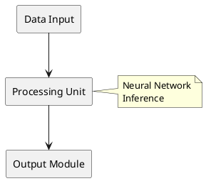
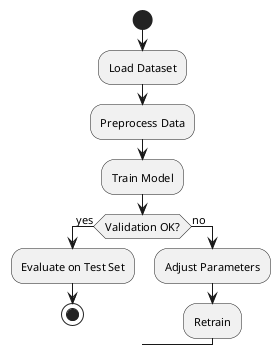
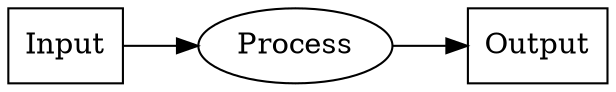
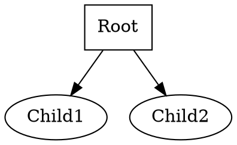

# Figure Integrator

## Purpose

Create, format, and integrate figures into academic papers following Elsevier guidelines.

## When to Trigger

- User requests a new figure
- User needs figure formatting help
- User mentions generating diagrams
- User asks about figure placement or caption format

## Figure Generation

### Supported Tools

1. **PlantUML** - For diagrams, flowcharts, UML
2. **Graphviz** - For directed graphs, hierarchies
3. **LaTeX/TikZ** - For technical diagrams (via direct code)

### Generating a Figure

```bash
/figure <description>
```

Example:
```
/figure 生成一个系统架构图，展示数据处理流程
/figure create a flowchart for the experiment procedure
```

## Elsevier Figure Guidelines

### File Formats
- **Preferred**: PDF (vector graphics, crisp at any zoom)
- **Acceptable**: PNG, JPEG (300+ dpi required for raster)
- **Avoid**: GIF, BMP (low quality)

### Sizing
- Single column: max 8cm width
- Double column: max 17cm width
- Keep simple enough to read at print size

### Caption Placement
```latex
\begin{figure}[htbp]
    \centering
    \includegraphics[width=0.8\textwidth]{figures/fig1.pdf}
    \caption{Concise description of what figure shows.}
    \label{fig:overview}
\end{figure}
```

### Subfigures
```latex
\begin{figure}[htbp]
    \centering
    \begin{subfigmatrix}{2}
        \subfig{fig1a.pdf}{(a) First part}
        \subfig{fig1b.pdf}{(b) Second part}
    \end{subfigmatrix}
    \caption{Overall figure caption.}
    \label{fig:combined}
\end{figure}
```

## PlantUML Examples

### System Architecture


### Flowchart


## Graphviz Examples

### Directed Graph


### Hierarchy


## Figure Quality Checklist

- [ ] File format is PDF or high-resolution PNG/JPG
- [ ] Dimensions fit single or double column
- [ ] Text is legible at print size (min 8pt)
- [ ] Colors work in grayscale (for print journals)
- [ ] Caption is informative but concise
- [ ] Figure is referenced in main text
- [ ] Labels are clear (a), (b), etc. for subfigures

## Usage Examples

- `/figure 生成实验流程图`
- `/figure create a comparison table`
- `/figure 帮助我添加一个性能对比图`
