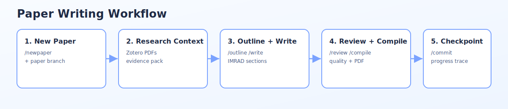

# ✍️ Academic Writing Template for Engineering Research

[](https://www.npmjs.com/package/@2p1c/harness-writing)


> 专为理工科英文学术论文设计的写作模版仓库，集成 Elsevier 期刊格式、LaTeX 编译流程、AI 写作辅助技能，以及对抗性文本审查系统。  
> "Academic paper writing template for engineering research with Elsevier format, LaTeX, AI writing skills, and adversarial text review."



## 🚀 快速开始

### 第一步：安装技能包

```bash
npm install -g @2p1c/harness-writing
```

Restart your agent after installation to load the new skills.

### 第二步：创建论文分支（推荐）

先用论文题目创建独立分支，避免多篇论文混在同一分支：

```bash
# 直接告诉 AI 你的论文题目即可触发
创建一篇新论文：基于深度学习的医学影像诊断研究
```

该流程会复用 `git-flow-branch-creator`，并按题目生成分支名（如 `feature/paper-...`）。

### 第三步：初始化论文项目

```
/newpaper 基于深度学习的医学影像诊断研究
```

### 第四步：收集研究资料（可选，推荐）

初始化后，AI 会询问是否启用 Zotero Context Injector。启用后：

- 读取指定 Zotero 文献集中的论文 PDF
- 提取摘要和关键段落
- 生成结构化写作上下文包，作为后续大纲和章节撰写的证据支撑

如果跳过此步，大纲和章节将基于通用学术知识生成，不引用你本地文献。

### 第五步：生成论文大纲

```
/outline 基于深度学习的医学影像诊断研究
```

### 第六步：撰写章节

```
/write introduction
/write methodology
```

推荐写作顺序：Methodology → Results → Introduction → Discussion → Conclusion → Abstract

**实时预览**：撰写过程中启动 `/preview`，浏览器自动刷新 PDF（依赖 `latexmk`：macOS `brew install --cask mactex`；Linux `sudo apt install texlive-latex-base latexmk`）。

### 第七步：对抗性审查

```
/review introduction
```

### 第八步：编译 PDF

```
/compile
```

### 第九步：结束当天写作并提交进度（推荐）

当你说“结束”或“今天就写到这了”，会触发写作会话提交技能，自动复用 `git-commit` 提交当前进度，并在 commit 信息中包含本次涉及的文件路径。


### 第十步：下次继续前快速回顾进度

打开仓库后可以直接说：

```text
我上次写到哪里了
```

系统会基于最近提交历史总结当前写作进度、最近修改文件和下一步建议。

---

## 🌟 核心功能

| 功能 | 说明 |
|------|------|
| **收集研究资料** | 导入 Zotero 文献集，读取 PDF 生成写作上下文包 |
| **IMRAD 大纲生成** | 输入研究主题，AI 生成标准学术论文结构 |
| **LaTeX 章节撰写** | 按 Elsevier 格式撰写各章节，含正确引用格式 |
| **对抗性文本审查** | 双代理循环批评（Critic → 质疑）+ 改进（Improver → 完善）|
| **实时预览** | LaTeX 保存即刷新 PDF 预览 |
| **一键 PDF 编译** | 完整的 LaTeX → BibTeX → PDF 工作流 |
| **引用管理** | BibTeX 格式验证，引用一致性检查 |

## 🧭 命令/短语触发参考

| 命令 | 功能 | 示例 |
|------|------|------|
| `/newpaper <标题>` | 初始化新论文项目 | `/newpaper 机器视觉研究` |
| `/outline <主题>` | 生成 IMRAD 大纲 | `/outline 深度学习优化算法` |
| `/write <章节>` | 撰写指定章节 | `/write methodology` |
| `/review` | 对抗性文本审查 | `/review introduction` |
| `/cite <作者年份>` | 添加引用 | `/cite LeCun 2015` |
| `/figure <描述>` | 生成图表代码 | `/figure 系统架构图` |
| `/compile` | 编译 PDF | `/compile` |
| `/paper-branch <论文题目>` 或自然语言 | 按论文题目创建独立分支（复用 Git Flow 分支技能） | `创建一篇新论文：基于深度学习的医学影像诊断研究` 或 `/paper-branch 基于深度学习的医学影像诊断研究` |
| `/paper-checkpoint` 或自然语言 | 结束本次写作并提交阶段进度（复用 git-commit） | `今天就写到这了` 或 `/paper-checkpoint` |
| `/paper-progress` 或自然语言 | 基于最近提交历史回顾论文写作进度 | `我上次写到哪里了` 或 `/paper-progress` |

## 🧩 Skills

| Skill | Trigger | Description |
|-------|---------|-------------|
| `academic-review` | `/review` | Adversarial dual-agent text critique |
| `figure-integrator` | `/figure` | Generate academic figures |
| `latex-paper-en` | `/write` | Write LaTeX sections (Elsevier) |
| `latex-live-preview` | `/preview` | Real-time PDF preview with auto-reload |
| `literature-manager` | `/cite` | Manage citations |
| `zotero-context-injector` | (自动) | Import Zotero PDFs and generate writing context pack |
| `paper-outline-generator` | `/outline` | Generate IMRAD paper outlines |
| `research-paper-writer` | `/newpaper` | End-to-end paper orchestration |
| `git-commit` | `/commit` | Intelligent conventional commits |
| `git-flow-branch-creator` | `/branch` | Auto Git Flow branches |
| `paper-branch-by-title` | “创建新论文”, “new paper” | Create a paper-specific branch from title (reuses `git-flow-branch-creator`) |
| `paper-session-checkpoint-commit` | “结束”, “今天就写到这了” | End-of-session progress commit with file paths (reuses `git-commit`) |
| `paper-writing-progress-review` | “我上次写到哪里了” | Infer current writing progress from recent commits |
| `skill-creator` | `/skill-create` | Create Claude Code skills |

Plus 14 superpowers: brainstorming, executing-plans, test-driven-development, systematic-debugging, writing-plans, verification-before-completion, and more.

## 🗂️ 项目结构

```
harness-writing/
├── manuscripts/                 # 论文项目工作目录
├── templates/elsevier/          # Elsevier 模板
├── skills/                     # Claude Code skills（npm 包安装位置）
├── .agents/skills/             # 原本地位置（符号链接来源）
└── CLAUDE.md                   # AI 助手指南
```

## 🛠️ 故障排除

| 问题 | 解决方案 |
|------|----------|
| Zotero 连接失败 | 运行 `python3 .agents/skills/zotero-context-injector/scripts/build_zotero_context.py --list-collections` 确认路径是否正确；参考 `skills/zotero-context-injector/references/zotero-setup.md` 配置 Zotero 数据目录 |
| `elsarticle.cls not found` | `tlmgr install elsarticle` |
| `bibtex command not found` | 安装完整 LaTeX 发行版 |
| 编译后引用显示 `[?]` | 运行 `make clean && make paper` |
| `/preview` 无法启动 | 确认已安装 `latexmk` 和 `mactex` |

## 🧹 Uninstall

```bash
npm uninstall -g @2p1c/harness-writing
```

## 📄 License

MIT
