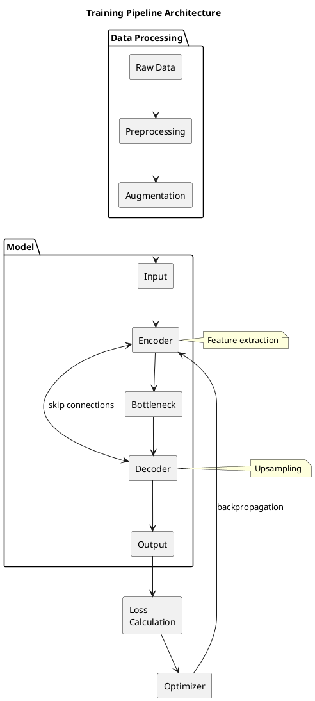

# Figure Generator for Academic Papers

## Purpose

Generate all figures listed in methodology.md, producing PlantUML (.tex) files for pipeline/schematic diagrams and matplotlib (.pdf) files for results plots. Automatically integrate figure references into the correct section at the appropriate locations.

## When to Trigger

- User invokes `/aw-figure`
- User says "generate figures", "制图", "produce figures from methodology"
- Called automatically after Phase 2 section writing (methodology, results, experiment sections written)
- When methodology.md "Figures Needed" section has been populated

## Workflow

```
methodology.md ("Figures Needed")
         │
         ▼
┌─────────────────────────┐
│  Extract Figure List     │
│  - Fig.1 Pipeline        │ → PlantUML
│  - Fig.2 Architecture    │ → PlantUML
│  - Fig.3 Training        │ → PlantUML
│  - Fig.4-9 Results       │ → matplotlib
│  - Fig.10+ (if any)      │ → placeholder
└───────────┬─────────────┘
            │
    ┌───────┴───────┐
    │  Data Check   │
    └───────┬───────┘
            │
    ┌───────┴───────┐
    │Complete data? │
    └───────┬───────┘
      Yes / \ No
       /     \
      ▼       ▼
 ┌──────── ┌────────────┐
 │Generate │Partial/None│
 │ .tex/.pdf   │  Generate   │
 │ with data  │  placeholder │
 └──────── └────────────┘
            │
            ▼
 manuscripts/{slug}/figures/
            │
            ▼
 Auto-insert \input{} at
 correct location in sections
```

## Step-by-Step Procedure

### Step 1: Extract Figure List from methodology.md

Read `manuscripts/{slug}/methodology.md` and locate the "Figures Needed" section. Parse each figure entry:

```markdown
## Figures Needed

| Figure | Type | Caption | Location |
|--------|------|---------|----------|
| Fig.1 Pipeline schematic | diagram | Training pipeline architecture | methodology.tex |
| Fig.2 Network architecture | diagram | U-Net structure with skip connections | methodology.tex |
| Fig.3 Training pipeline | diagram | Data flow during training | methodology.tex |
| Fig.4 SNR comparison | plot | SNR improvement across methods | results.tex |
| Fig.5 Convergence curve | plot | Training loss over epochs | results.tex |
```

Extract:
- **Figure ID**: `fig:1`, `fig:4`, etc.
- **Type**: `diagram` (PlantUML) or `plot` (matplotlib)
- **Caption**: The figure caption text
- **Target section**: Which .tex file should reference this figure

### Step 2: Data Availability Check

For each figure, check if required data exists:

| Figure Type | Data Source | If Missing |
|-------------|-------------|-------------|
| Pipeline/Architecture diagrams | User provides or methodology.md describes | Generate with placeholder boxes and labels |
| Training pipeline | User provides flow description | Generate from methodology text description |
| SNR comparison plots | sections/results/*.tex or user provides CSV | Generate with placeholder bars |
| Convergence curves | User provides training log or CSV | Generate with placeholder curve |
| Other plots | sections/results/*.tex | Generate with available data or placeholder |

### Step 3: Generate Diagrams (PlantUML → .tex)

For `diagram`-type figures, generate PlantUML and compile to .tex:

**Pipeline Schematic (Fig.1) Example:**


**Output format** (wrap in LaTeX figure environment):
```latex
\begin{figure}[htbp]
  \centering
  \input{figures/fig1-pipeline}
  \caption{Training pipeline architecture showing data flow from preprocessing through model training to output generation.}
  \label{fig:pipeline}
\end{figure}
```

Save to: `manuscripts/{slug}/figures/fig1-pipeline.tex`

### Step 4: Generate Plots (matplotlib → .pdf)

For `plot`-type figures, generate matplotlib scripts and compile to PDF:

**SNR Comparison Plot (Fig.4) Example:**
```python
import matplotlib.pyplot as plt
import numpy as np

# Data (replace with actual values from results section)
methods = ['Baseline', 'Method A', 'Proposed\nMethod']
snr_values = [12.5, 18.3, 24.7]
colors = ['#cccccc', '#999999', '#2c5aa0']

fig, ax = plt.subplots(figsize=(8, 5))
bars = ax.bar(methods, snr_values, color=colors, width=0.6)

ax.set_ylabel('SNR Improvement (dB)', fontsize=12)
ax.set_xlabel('Method', fontsize=12)
ax.set_title('Signal-to-Noise Ratio Comparison', fontsize=14)
ax.set_ylim(0, 30)

# Add value labels on bars
for bar, val in zip(bars, snr_values):
    ax.text(bar.get_x() + bar.get_width()/2, bar.get_height() + 0.5,
            f'{val:.1f}', ha='center', va='bottom', fontsize=11)

plt.tight_layout()
plt.savefig('manuscripts/{slug}/figures/fig4-snr-comparison.pdf', dpi=300)
plt.close()
```

**Output format** (wrap in LaTeX figure environment):
```latex
\begin{figure}[htbp]
  \centering
  \includegraphics[width=0.9\textwidth]{figures/fig4-snr-comparison.pdf}
  \caption{Signal-to-noise ratio (SNR) improvement comparison across methods. Error bars represent standard deviation over 5 runs.}
  \label{fig:snr-comparison}
\end{figure}
```

Save to: `manuscripts/{slug}/figures/fig4-snr-comparison.pdf`

### Step 5: Create Placeholder Figures

If data is unavailable or incomplete, generate placeholder figures:

**Placeholder for diagram:**
```latex
\begin{figure}[htbp]
  \centering
  \fbox{
    \begin{minipage}[c]{0.8\textwidth}
      \vspace{2cm}
      \centering
      \textbf{[Figure N: Description — Data pending]}\\
      \vspace{2cm}
    \end{minipage}
  }
  \caption{Caption text.}
  \label{fig:name}
\end{figure}
```

**Placeholder for plot:**
```latex
\begin{figure}[htbp]
  \centering
  \begin{tikzpicture}
    \node[draw, dashed, minimum width=8cm, minimum height=5cm] (box) {
      \begin{minipage}{7cm}
        \centering
        \textbf{[Figure N: Description — Data pending]}\\
        \vspace{3cm}
      \end{minipage}
    };
  \end{tikzpicture}
  \caption{Caption text.}
  \label{fig:name}
\end{figure}
```

### Step 6: Auto-Insert Figure References

After generating all figures, insert `\input{figures/fig-name}` or `\includegraphics` at the correct location in each section file:

**For methodology.tex:**
- Fig.1, Fig.2, Fig.3 → Insert after the paragraph that describes each component
- Use grep to find relevant section: `grep -n "pipeline\|architecture\|training" methodology.tex`

**For results.tex:**
- Fig.4-9 → Insert after the paragraph that discusses each result
- Use grep to find relevant section: `grep -n "Table\|shown\|observed\|results indicate" results.tex`

**Insertion format for .tex figures:**
```latex
% After paragraph discussing pipeline
\input{figures/fig1-pipeline}
```

**Insertion format for .pdf figures:**
```latex
% After paragraph discussing SNR results
\begin{figure}[htbp]
  \centering
  \includegraphics[width=0.9\textwidth]{figures/fig4-snr-comparison.pdf}
  \caption{Signal-to-noise ratio comparison across methods.}
  \label{fig:snr-comparison}
\end{figure}
```

## File Structure

After completion, the figures directory should contain:

```
manuscripts/{slug}/figures/
├── fig1-pipeline.tex          # PlantUML output (compiled .tex)
├── fig2-architecture.tex
├── fig3-training.tex
├── fig4-snr-comparison.pdf   # matplotlib output
├── fig5-convergence.pdf
├── fig6-ablation-study.pdf
├── fig7-generalization.pdf
├── fig8-comparison-baselines.pdf
├── fig9-loss-landscape.pdf
└── fig10-placeholder.tex     # If needed, placeholder
```

## Quality Checklist

- [ ] All figures in methodology.md "Figures Needed" are generated
- [ ] Diagrams use consistent styling (font sizes, arrow types, colors)
- [ ] Plots use consistent color schemes and axis formatting
- [ ] All figures have proper \caption and \label
- [ ] All \input{} or \includegraphics{} references are inserted in correct sections
- [ ] Figure references in text match labels (e.g., "as shown in Fig. 1")
- [ ] No missing \ref{} in text for generated figures
- [ ] Files saved to correct path: manuscripts/{slug}/figures/

## Trigger Variations

- `/aw-figure` — Full figure generation pipeline
- `/aw-figure fig1` — Generate only Fig.1
- `/aw-figure check` — Check figure status without generating
- `/aw-figure update` — Update existing figures with new data

## Error Handling

| Error | Response |
|-------|----------|
| methodology.md not found | Ask user to provide path or run paper-outline-generator first |
| PlantUML not installed | Generate .tex files with tikz code instead |
| matplotlib script fails | Generate placeholder, log error, continue with others |
| Figure already exists | Prompt: "Overwrite existing figure? (yes/no)" |
| No figures listed in methodology.md | Report: "No figures found in methodology.md. Nothing to generate." |
